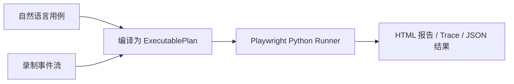

# UI Case Compiler 第一版使用文档

## 1. 项目定位

UI Case Compiler 是一个用于学习和展示 UI 自动化测试工程能力的第一版项目。它解决的核心痛点是：

传统 Selenium / Playwright 需要直接写脚本，前端同学相对容易上手，但后端和测试同学门槛较高，导致 UI 回归覆盖率低。

第一版实现两条用例创建路径：

- 自然语言用例：把用户写的测试描述编译为结构化步骤 DSL。
- 录制事件流：把用户操作过一遍后产生的事件 JSON 编译为结构化步骤 DSL。

两条路径最终都会生成同一种 `ExecutablePlan`。后续回归执行只跑已保存的计划，不在每一步执行时调用模型。



## 2. 第一版边界

第一版只使用 Python 实现。

第一版包含：

- 步骤 DSL 与可执行计划模型。
- 参数解析和动态变量。
- 定位器解析和 fallback。
- Playwright Python 执行器。
- 截图、trace、HTML 报告。
- 本地 JSON 文件存储。
- 离线录制事件流编译。
- Mock 自然语言编译。
- CLI 命令入口。
- 示例页面、示例计划、测试和 CI 模板。

第一版不包含：

- Web UI。
- React 前端。
- HTTP API 服务。
- 真实浏览器录制插件。
- 真实 LLM Provider。
- SQLite 或数据库存储。
- 多用户、登录、权限管理。

React 前端控制台放在第二版。

## 3. 环境要求

推荐环境：

| 项目 | 版本 |
| --- | --- |
| Python | 3.11+，推荐 3.12 |
| 浏览器自动化 | Playwright for Python |
| 操作系统 | Windows / macOS / Linux |
| 包管理 | pip |

当前项目主要在 Windows PowerShell 下验证。

## 4. 获取项目

如果你已经在当前 workspace 中，项目目录为：

```powershell
F:\ui-auto-test\ui_case_compiler
```

进入项目：

```powershell
cd F:\ui-auto-test\ui_case_compiler
```

## 5. 安装依赖

### 5.1 创建虚拟环境

Windows PowerShell：

```powershell
py -3.12 -m venv .venv
.\.venv\Scripts\Activate.ps1
```

如果本机没有 `py` 启动器，可以使用：

```powershell
python -m venv .venv
.\.venv\Scripts\Activate.ps1
```

macOS / Linux：

```bash
python3 -m venv .venv
source .venv/bin/activate
```

### 5.2 安装 Python 依赖

```powershell
python -m pip install --upgrade pip
python -m pip install -e '.[dev]'
```

这里的 `-e` 表示 editable install，本地修改代码后不需要重新安装包。

安装内容包括：

- `playwright`：浏览器自动化执行。
- `pydantic`：DSL 和运行结果校验。
- `typer`：CLI 命令行。
- `jinja2`：HTML 报告模板。
- `rich`：命令行输出扩展。
- `pytest`：测试。
- `ruff`：代码检查。
- `mypy`：类型检查。

### 5.3 安装 Playwright 浏览器

第一版默认使用 Chromium：

```powershell
python -m playwright install chromium
```

如果你在 CI 或 Linux 机器上安装系统依赖，可以使用：

```bash
python -m playwright install --with-deps chromium
```

## 6. 验证安装

查看 CLI：

```powershell
ui-case --help
```

如果 `ui-case` 不在 PATH 中，可以使用模块方式：

```powershell
python -m ui_case_compiler.cli.main --help
```

运行测试：

```powershell
python -m pytest
```

运行代码检查：

```powershell
python -m ruff check .
python -m mypy src
```

当前第一版完整验证结果应为：

```text
43 passed
All checks passed
Success: no issues found
```

## 7. 项目目录说明

```text
ui_case_compiler/
  pyproject.toml
  README.md
  docs/
    v1-user-guide.md
  examples/
    pages/
      login.html
    plans/
      login.json
    recordings/
      login-events.json
    natural_language/
      login.txt
    context/
      login.json
  src/ui_case_compiler/
    cli/
    compiler/
    recorder/
    reporter/
    runner/
    schema/
    storage/
  tests/
```

核心模块：

| 模块 | 作用 |
| --- | --- |
| `schema` | 定义 Step DSL、Locator、ExecutablePlan |
| `runner` | 参数解析、定位器解析、Playwright 执行、dry-run |
| `recorder` | 离线录制事件流转步骤 DSL |
| `compiler` | 自然语言转步骤 DSL，第一版使用 Mock Provider |
| `reporter` | RunResult、截图、trace、HTML 报告 |
| `storage` | 本地 JSON 文件存储 |
| `cli` | 命令行入口 |

## 8. CLI 命令总览

```powershell
ui-case validate <plan.json>
ui-case run <plan.json>
ui-case dry-run <plan.json>
ui-case compile-recording <events.json>
ui-case compile-nl <case.txt> --context <context.json>
ui-case config
```

### 8.1 `validate`

校验可执行计划 JSON 是否符合 DSL：

```powershell
ui-case validate examples\plans\login.json
```

成功输出类似：

```text
Valid plan: login-example (5 steps)
```

### 8.2 `run`

执行计划并生成报告：

```powershell
$PAGE_URL = python -c "from pathlib import Path; print(Path('examples/pages/login.html').resolve().as_uri())"
ui-case run examples\plans\login.json --param loginPageUrl=$PAGE_URL
```

成功输出类似：

```text
Run status: passed
Report: .ui-case-compiler\reports\run-xxxx.html
Trace: .ui-case-compiler\artifacts\run-xxxx\trace.zip
```

如果计划失败，命令会返回非 0 退出码，并输出失败步骤摘要。

### 8.3 `dry-run`

试运行计划，并根据结果更新用例状态：

```powershell
ui-case dry-run examples\plans\login.json --param loginPageUrl=$PAGE_URL
```

行为：

- 通过：用例状态标记为 `ready`。
- 失败：用例状态保持或写回 `draft`。

状态文件会写入：

```text
.ui-case-compiler/cases/<plan_id>.json
```

### 8.4 `compile-recording`

把离线录制事件流转换为可执行计划：

```powershell
ui-case compile-recording examples\recordings\login-events.json --name "Login Recording" -o .ui-case-compiler\plans\login-recording.json
```

输入事件示例：

```json
[
  {
    "type": "click",
    "timestamp": 1,
    "element": {
      "tag": "button",
      "role": "button",
      "text": "Login"
    }
  }
]
```

第一版支持的事件类型：

| 事件类型 | 转换结果 |
| --- | --- |
| `navigation` | `navigate` |
| `click` | `click` |
| `input` | `fill` |
| `change` | `fill` / `select` / `check` |
| `mousemove` | 忽略 |

连续输入会归并，只保留最终值。

### 8.5 `compile-nl`

把自然语言用例转换为可执行计划：

```powershell
ui-case compile-nl examples\natural_language\login.txt --context examples\context\login.json -o .ui-case-compiler\plans\login-nl.json
```

第一版使用 `MockLLMProvider`，用于展示编译链路：

```text
自然语言文本
-> PromptBuilder
-> MockLLMProvider
-> JSON 解析
-> Pydantic DSL 校验
-> ExecutablePlan
```

第一版不会调用真实大模型，也不会产生 token 成本。

## 9. 从零跑通示例

### 9.1 生成本地页面地址

示例页面在：

```text
examples/pages/login.html
```

生成 `file://` 地址：

```powershell
$PAGE_URL = python -c "from pathlib import Path; print(Path('examples/pages/login.html').resolve().as_uri())"
```

查看变量：

```powershell
$PAGE_URL
```

输出类似：

```text
file:///F:/ui-auto-test/ui_case_compiler/examples/pages/login.html
```

### 9.2 校验计划

```powershell
ui-case validate examples\plans\login.json
```

### 9.3 执行计划

```powershell
ui-case run examples\plans\login.json --param loginPageUrl=$PAGE_URL
```

该计划会执行：

1. 打开本地登录页。
2. 输入用户名。
3. 输入密码。
4. 点击 Login。
5. 验证出现 `Welcome back`。

### 9.4 查看报告

默认输出目录：

```text
.ui-case-compiler/
```

主要文件：

```text
.ui-case-compiler/
  reports/
    run-xxxx.html
  artifacts/
    run-xxxx/
      trace.zip
  runs/
    run-xxxx.json
```

直接用浏览器打开 HTML 报告即可查看每一步状态、耗时、错误和附件路径。

### 9.5 查看 Trace

Playwright trace 可以用下面命令查看：

```powershell
python -m playwright show-trace .ui-case-compiler\artifacts\run-xxxx\trace.zip
```

把 `run-xxxx` 替换为实际运行 ID。

## 10. Step DSL 说明

一个可执行计划长这样：

```json
{
  "id": "login-example",
  "name": "Login Example",
  "source": "manual",
  "parameters": {
    "username": "demo@example.com",
    "password": "secret"
  },
  "steps": [
    {
      "id": "step-001",
      "type": "navigate",
      "url": "${loginPageUrl}"
    }
  ]
}
```

### 10.1 支持的动作步骤

| Step | 含义 |
| --- | --- |
| `navigate` | 打开 URL |
| `click` | 点击元素 |
| `fill` | 输入文本 |
| `select` | 下拉选择 |
| `check` | 勾选 checkbox / switch |
| `hover` | 悬停 |
| `wait` | 固定等待 |

### 10.2 支持的断言步骤

| Step | 含义 |
| --- | --- |
| `assert_visible` | 元素可见 |
| `assert_text` | 元素包含文本 |
| `assert_value` | 输入框值匹配 |
| `assert_url` | URL 匹配 |

### 10.3 定位器优先级

推荐优先使用更接近用户视角和可访问性的定位器：

```text
role -> label -> placeholder -> test_id -> text -> css -> xpath
```

示例：

```json
{
  "primary": {
    "strategy": "role",
    "role": "button",
    "name": "Login"
  },
  "fallbacks": [
    {
      "strategy": "text",
      "value": "Login"
    }
  ],
  "confidence": 0.95
}
```

## 11. 参数说明

参数解析优先级：

```text
runtime_params > case_params > environment_params > global_params
```

CLI 中通过 `--param` 传运行时参数：

```powershell
ui-case run examples\plans\login.json --param loginPageUrl=$PAGE_URL --param username=alice
```

计划中引用：

```json
{
  "type": "fill",
  "value": "${username}"
}
```

内置动态变量：

| 变量 | 含义 |
| --- | --- |
| `${timestamp}` | 当前运行时间戳 |
| `${randomString}` | 当前运行内稳定的随机字符串 |

同一次运行中，同名动态变量保持一致。

## 12. 报告与存储

默认输出目录：

```text
.ui-case-compiler/
```

目录结构：

```text
.ui-case-compiler/
  cases/
  plans/
  runs/
  reports/
  artifacts/
```

说明：

| 目录 | 内容 |
| --- | --- |
| `cases` | 用例状态，如 `draft` / `ready` |
| `plans` | 编译生成的计划 |
| `runs` | 每次运行的 JSON 结果 |
| `reports` | HTML 报告 |
| `artifacts` | 截图、trace 等执行证据 |

## 13. 测试与质量门

运行全部测试：

```powershell
python -m pytest
```

运行静态检查：

```powershell
python -m ruff check .
```

运行类型检查：

```powershell
python -m mypy src
```

第一版要求三项都通过后再视为可提交。

## 14. CI 示例

项目已经提供 GitHub Actions 模板：

```text
.github/workflows/ui-case.yml
```

CI 会执行：

1. 安装 Python。
2. 安装项目依赖。
3. 安装 Playwright Chromium。
4. 执行 `ruff`。
5. 执行 `mypy`。
6. 执行 `pytest`。
7. 执行示例 UI 用例。
8. 上传 `.ui-case-compiler` 产物。

## 15. 常见问题

### 15.1 `ui-case` 命令找不到

先确认已经激活虚拟环境：

```powershell
.\.venv\Scripts\Activate.ps1
```

如果仍然找不到，可以使用模块方式：

```powershell
python -m ui_case_compiler.cli.main --help
```

### 15.2 Playwright 提示没有浏览器

执行：

```powershell
python -m playwright install chromium
```

### 15.3 PowerShell 不允许激活虚拟环境

可能是执行策略限制。可以在当前用户范围调整：

```powershell
Set-ExecutionPolicy -ExecutionPolicy RemoteSigned -Scope CurrentUser
```

然后重新执行：

```powershell
.\.venv\Scripts\Activate.ps1
```

### 15.4 `loginPageUrl` 参数缺失

示例计划中 `url` 使用了 `${loginPageUrl}`，运行时必须传入：

```powershell
$PAGE_URL = python -c "from pathlib import Path; print(Path('examples/pages/login.html').resolve().as_uri())"
ui-case run examples\plans\login.json --param loginPageUrl=$PAGE_URL
```

### 15.5 自然语言编译为什么不是智能模型

第一版目标是打通“自然语言 -> 编译计划 -> 稳定执行”的工程闭环，所以使用 `MockLLMProvider`。真实模型接入放到后续版本，接口已经通过 `LLMProvider` 预留。

### 15.6 为什么录制不是直接打开浏览器录制

第一版实现的是离线事件流转换能力，用 JSON 模拟录制结果。真实浏览器录制涉及页面注入脚本、事件监听、元素快照和交互 UI，放到后续版本。

### 15.7 PowerShell 中中文帮助显示乱码

如果 `ui-case --help` 的中文说明显示成乱码，先把当前终端切到 UTF-8：

```powershell
chcp 65001
$env:PYTHONUTF8 = "1"
ui-case --help
```

也可以在 PyCharm / VS Code 的终端设置中确认编码为 UTF-8。

## 16. 学习顺序建议

建议按这个顺序阅读源码：

1. `src/ui_case_compiler/schema/steps.py`
2. `src/ui_case_compiler/schema/executable_plan.py`
3. `src/ui_case_compiler/runner/parameter_resolver.py`
4. `src/ui_case_compiler/runner/locator_resolver.py`
5. `src/ui_case_compiler/runner/plan_runner.py`
6. `src/ui_case_compiler/recorder/recorder_session.py`
7. `src/ui_case_compiler/compiler/natural_language_compiler.py`
8. `src/ui_case_compiler/cli/main.py`

对应测试：

```text
tests/schema/
tests/runner/
tests/recorder/
tests/compiler/
tests/cli/
tests/examples/
```

## 17. 简历表达参考

可以这样描述第一版：

```text
设计并实现一个 Python UI 自动化用例编译平台，支持将自然语言用例和录制事件流统一转换为结构化 DSL，再由 Playwright Python 稳定执行。项目实现参数化、语义化定位器 fallback、dry-run 校验、HTML 报告、trace 证据采集、本地 JSON 存储和 CI 示例，解决传统 UI 自动化脚本编写门槛高、自然语言逐步执行成本高且不稳定的问题。
```

技术关键词：

```text
Python, Playwright, Pydantic, Typer, Jinja2, Pytest, Ruff, Mypy, UI Automation, DSL, Test Compilation
```
